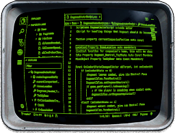

# 📜 Papyrus Language Tools

## Advanced language tools for the Papyrus scripting language.

You can now write mods for Fallout 4 and Skyrim with the aid of modern code editing features such as code completion, jump to definition, hover, symbol search and live updated diagnostics.

## 📺 Visual Studio Code Extension

Updated frequently with new features and improvements.

🔗 [Visual Studio Marketplace](https://marketplace.visualstudio.com/items?itemName=joelday.papyrus-lang-vscode)\
⚙️ [Source](src/papyrus-lang-vscode)
