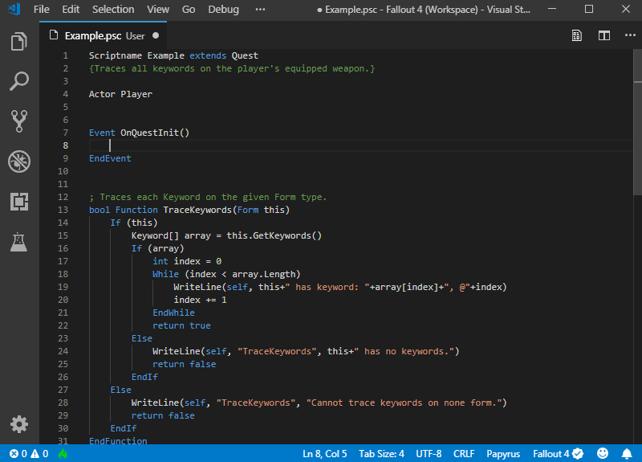
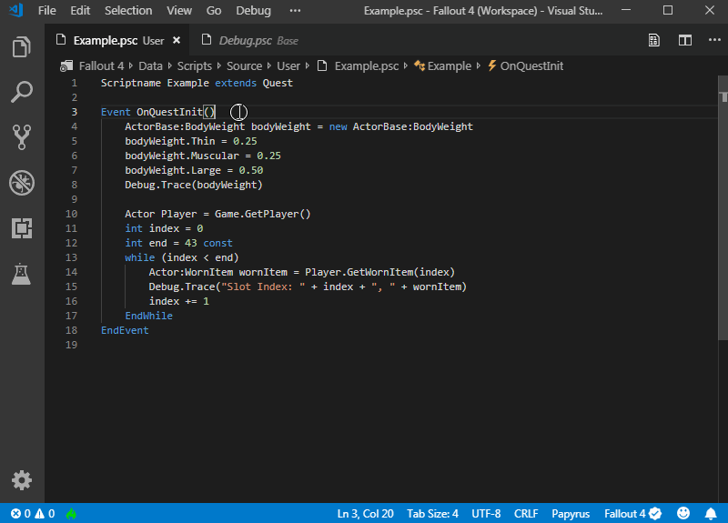
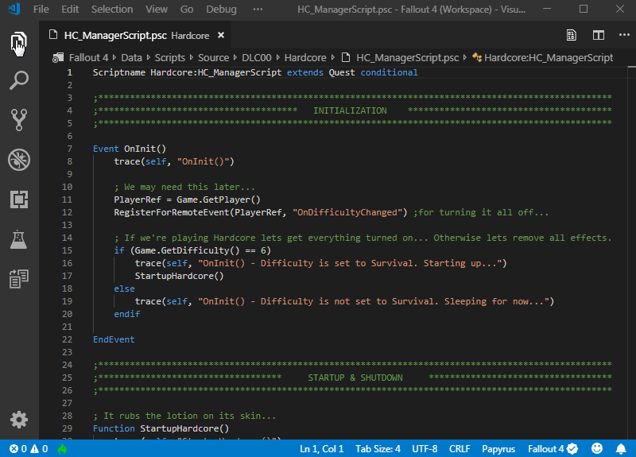

<h1 align="center">
    📜 Papyrus for Visual Studio Code
     
     
    
     
     
</h1>

## Fallout 4 and Skyrim Papyrus language support with code completion, definitions, hover, symbol outlines and live updated diagnostics.

# Features
## Autocomplete

## Go to and Peek Definition

## Symbol Outline
